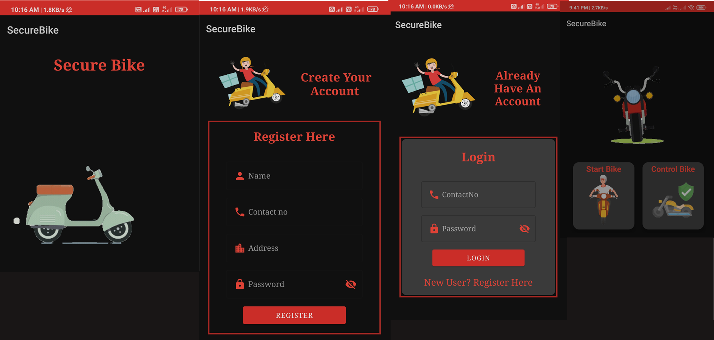

 

  <h3 align="center">Protection for Two Wheelers</h3>

## About The Project

The Anti-Theft Two-Wheeler Protection System is a security solution designed to safeguard two-wheelers from theft. The system comprises a mobile application and a microprocessor unit connected to the vehicle's ignition system through a relay. Key Features: Remote Control: Enable users to control their two-wheeler's ignition remotely via a mobile application. Ignition Control: Prevent unauthorized bike starts and halt the vehicle remotely. Mobile Application: Intuitive app interface for easy security settings management. Real-time Monitoring: Potential inclusion of real-time monitoring with alerts for suspicious activity. How It Works: The microprocessor unit integrated with the vehicle's ignition through a relay communicates securely with the mobile application. Users can send commands through the app to control the bike's ignition settings. Usage: Simple setup involves installing the microprocessor unit and downloading the mobile app. Users can conveniently manage security settings and control their two-wheeler's ignition remotely. Contributing: Contributions are welcome! Submit bug reports feature requests or pull requests to enhance the project's security features and functionality.

## Built With

Java,C++,Firebase

## Getting Started

To get a local copy up and running follow these simple example steps.

## Usage

we can start and stop the bike only from mobile application..

## Contributing

Contributions are what make the open source community such an amazing place to be learn, inspire, and create. Any contributions you make are **greatly appreciated**.
* If you have suggestions for adding or removing projects, feel free to [open an issue](https://github.com/kunal062001/An Anti-Theft Bike Protection/issues/new) to discuss it, or directly create a pull request after you edit the *README.md* file with necessary changes.
* Please make sure you check your spelling and grammar.
* Create individual PR for each suggestion.
* Please also read through the [Code Of Conduct](https://github.com/kunal062001/An Anti-Theft Bike Protection/blob/main/CODE_OF_CONDUCT.md) before posting your first idea as well.

### Creating A Pull Request

1. Fork the Project
2. Create your Feature Branch (`git checkout -b feature/AmazingFeature`)
3. Commit your Changes (`git commit -m 'Add some AmazingFeature'`)
4. Push to the Branch (`git push origin feature/AmazingFeature`)
5. Open a Pull Request

## Authors

* **Kunal Sarode** - *Software Developer* - [Kunal Sarode](https://github.com/kunal062001/) - **

